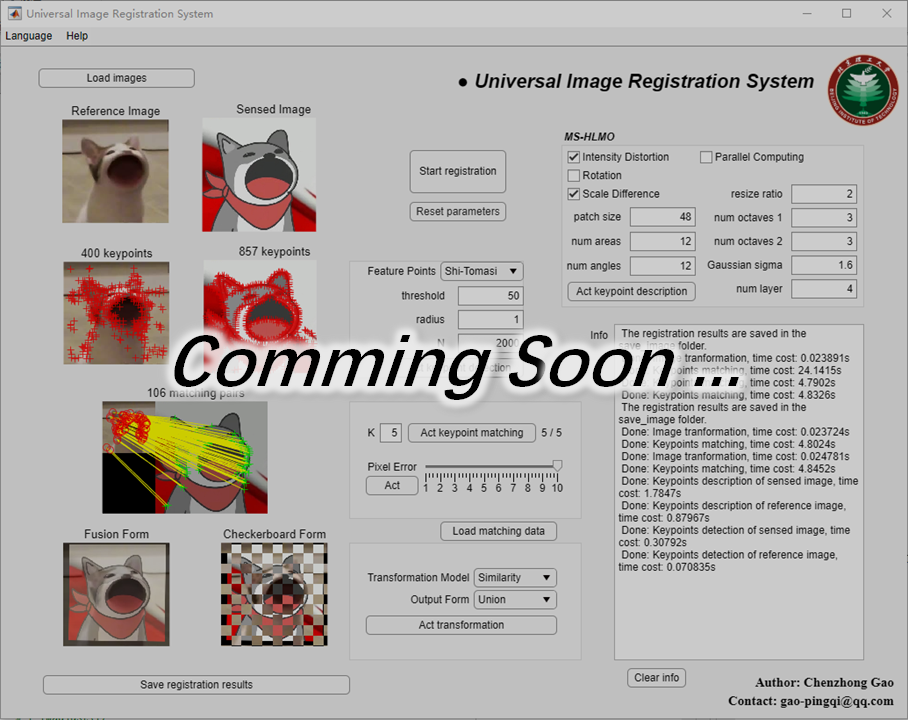

# MS-HLMO_registration

A new image matching/registration algorithm building upon and surpassing MS-HLMO, which is for the paper “Gao C, Li W. An invariant feature extraction for multi-modal images matching[J]. arXiv preprint arXiv:2311.02842, 2023.” [Online]. Available: https://ieeexplore.ieee.org/document/10641671

If you have any queries or suggestions, please do not hesitate to contact me (gao-pingqi@qq.com).
If you are from China, just speak Chinese, its OK~  中国人直接说中文就可以了~

Run this code by the following procedures:

1. Open and run "a_registration_main.m".
2. Set the parameters, if the procedures are clearly understood. Otherwise, use the default.
3. Choose the reference image.
4. Choose the sensed image.
5. Wait for the results.

** This project is just a demo for algorithm testing, and we highly recommend checking the practical version, which is now available at https://github.com/MrPingQi/MS-HLMO_registration-v2.1

Matching examples:

An image registration software based on MS-HLMO:

is comming soon.
