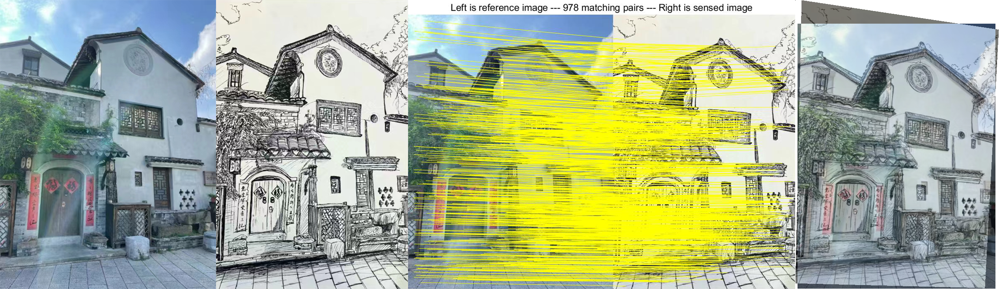
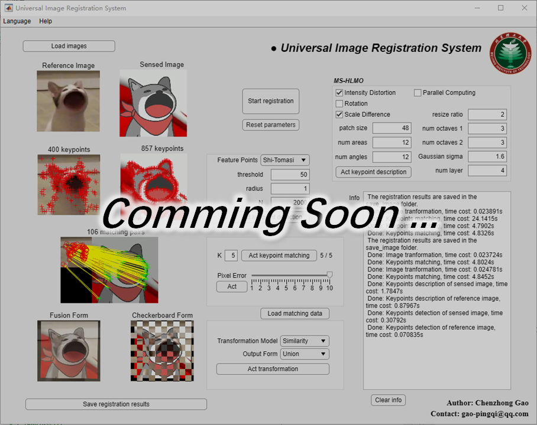

# MS-HLMOv2_registration

A new image matching/registration algorithm building upon and surpassing MS-HLMO.

Paper Link: https://ieeexplore.ieee.org/document/10641671

If you have any queries or suggestions, please do not hesitate to contact me (gao-pingqi@qq.com).
If you are from China, just speak Chinese, its OK~  中国人直接说中文就可以了~

Run this code by the following procedures:

1. Open and run "A_main_HLMOv2.m".
2. Set the parameters, if the procedures are clearly understood. Otherwise, use the default.
3. Choose the reference image.
4. Choose the sensed image.
5. Wait for the results.

<!---
** This project is just a demo for algorithm testing, and we highly recommend checking the practical version, which is now available at https://github.com/MrPingQi/MS-HLMO_registration-v2.1
-->
** Now this image matching algorithm is an old-fashioned one, and we highly recommend checking our new method: HOMO-Feature, which is now available at https://github.com/MrPingQi/HOMO-Feature_ImgMatching.


## 📈 Matching Performance 
Computer vision:



Remote sensing:

Medical:


## 📚 Citation
If you find our work useful in your research, please consider citing:
```bibtex
@inproceedings{gao2024new,
  title={A New Invariant Feature for Multi-Modal Images Matching},
  author={Gao, Chenzhong and Li, Wei and Li, Yute},
  booktitle={IGARSS 2024-2024 IEEE International Geoscience and Remote Sensing Symposium},
  pages={8374--8378},
  year={2024},
  organization={IEEE}
}
@article{gao2022ms,
  title={{MS-HLMO}: Multiscale histogram of local main orientation for remote sensing image registration},
  author={Gao, Chenzhong and Li, Wei and Tao, Ran and Du, Qian},
  journal={IEEE Transactions on Geoscience and Remote Sensing},
  volume={60},
  pages={1--14},
  year={2022},
  publisher={IEEE}
}
```

An image registration software based on MS-HLMO:

is comming soon.
